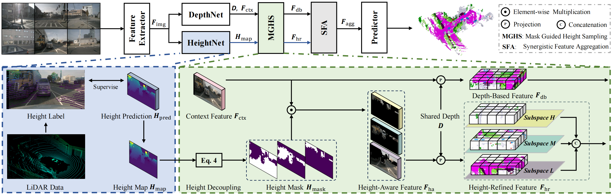
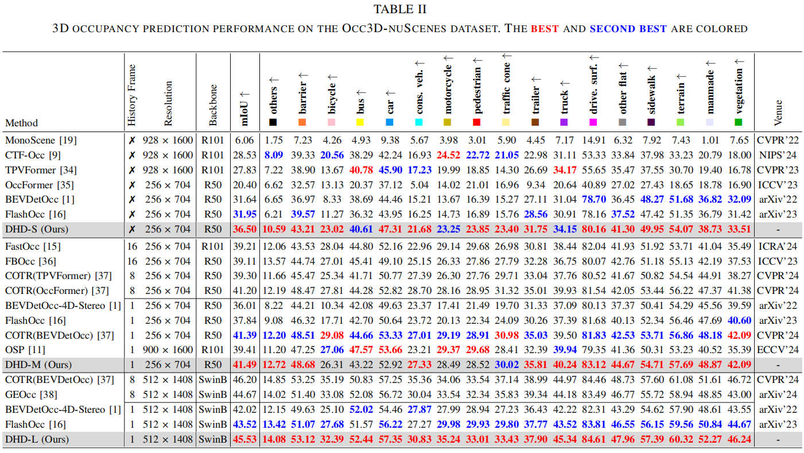
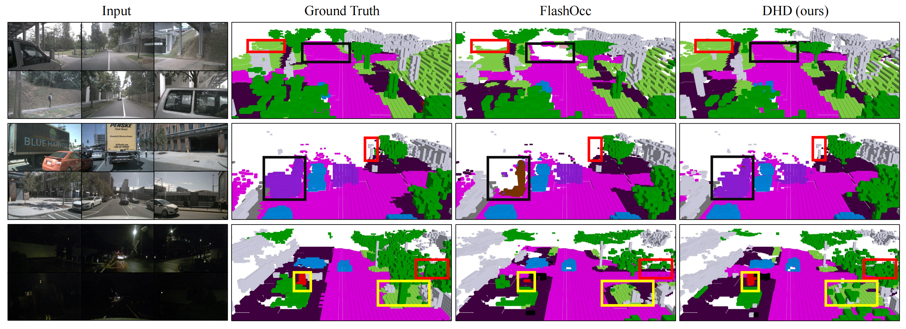

<p align="center">
<h2 align="center"> Deep Height Decoupling for Precise Vision-based 3D Occupancy Prediction  </h2>


<p align="center">
Yuan Wu</a><sup>1&ast;</sup>, 
<a href="https://yanzq95.github.io/">Zhiqiang Yan</a><sup>1&ast;&dagger;	</sup>, 
<a href="https://scholar.google.com/citations?user=VogTuQkAAAAJ&hl=zh-CN">Zhengxue Wang</a><sup>1</sup>, 
<a href="https://implus.github.io/">Xiang Li</a><sup>2</sup>, 
<a href="https://fpthink.github.io/">Le Hui</a><sup>3</sup>, 
<a href="https://scholar.google.com/citations?user=6CIDtZQAAAAJ&hl=zh-CN">Jian Yang</a><sup>1&dagger;</sup>
</p>


<p align="center">
  <sup>&ast;</sup>equal contribution&nbsp;&nbsp;&nbsp;
  <sup>&dagger;</sup>corresponding author&nbsp;&nbsp;&nbsp;<br>
  <sup>1</sup>Nanjing University of Science and Technology&nbsp;&nbsp;&nbsp;
  <sup>2</sup>Nankai University&nbsp;&nbsp;&nbsp;
  <sup>3</sup>Northwestern Polytechnical University&nbsp;&nbsp;&nbsp;
</p>

<p align="center">
[<a href="https://arxiv.org/pdf/2409.07972"><strong>Paper</strong></a>]
[<a href="https://yanzq95.github.io/projectpage/DHD/index.html"><strong>Project Page</strong></a>]
</p>

<div align="center">
  
</div>


## Method



**DHD** comprises a feature extractor, HeightNet, DepthNet, MGHS, SFA, and predictor. The feature extractor first acquires 2D image feature. Then, DepthNet extracts context feature and depth prediction. HeightNet generates the height map to determine the height value at each pixel. Next, MGHS integrates the output of HeightNet and DepthNet, acquiring height-refined feature and depth-based feature. Finally, the dual features are fed into the SFA to obtain the aggregated feature, which serves as input for the predictor.

## Get Started

###  Installation and Data Preparation

Step1、Prepare environment as that in [Install](doc/install.md).

Step2、Prepare nuScene and generate pkl file by runing：

```python
python tools/create_data_bevdet.py
```

The finnal directory structure for 'data' folder is like

```shell
└── data
  └── nuscenes
      ├── v1.0-trainval
      ├── maps  
      ├── sweeps  
      ├── samples
      ├── gts
      ├── bevdetv2-nuscenes_infos_train.pkl 
      └── bevdetv2-nuscenes_infos_val.pkl
```
###  Train & Test

```shell
# train:
tools/dist_train.sh ${config} ${num_gpu}
# train DHD-S:
tools/dist_train.sh projects/configs/DHD/DHD-S.py 4

# test:
tools/dist_test.sh ${config} ${ckpt} ${num_gpu} --eval mAP
# test DHD-S:
tools/dist_test.sh projects/configs/DHD/DHD-S.py model_weight/DHD-S.pth 4 --eval mAP
```
###  Model weights


The pretrained weights in 'ckpts' folder can be found <a href="https://drive.google.com/drive/folders/1eWT82gFlY-ivyoeWza2GKD71RvwoXUDk?usp=drive_link">here</a>.

All DHD model weights can be found <a href="https://drive.google.com/drive/folders/1lJGJ083Pubhe9XE_xSxoB6qHnYMJxH9W?usp=sharing">here</a>.

## Experiment
### Quantitative comparison


### Visual comparison

## Acknowledgements
Many thanks to the authors of   <a href="https://github.com/HuangJunJie2017/BEVDet">BEVDet</a> and <a href="https://github.com/Yzichen/FlashOCC">FlashOcc</a>.

## Citation

```
@article{wu2024deep,
  title={Deep Height Decoupling for Precise Vision-based 3D Occupancy Prediction},
  author={Wu, Yuan and Yan, Zhiqiang and Wang, Zhengxue and Li, Xiang and Hui, Le and Yang, Jian},
  journal={arXiv preprint arXiv:2409.07972},
  year={2024}
}
```


